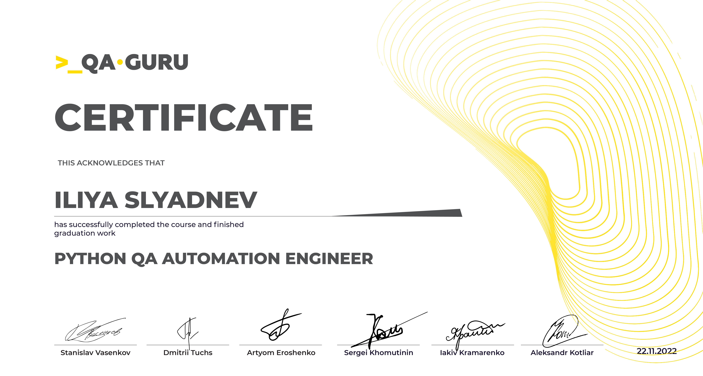
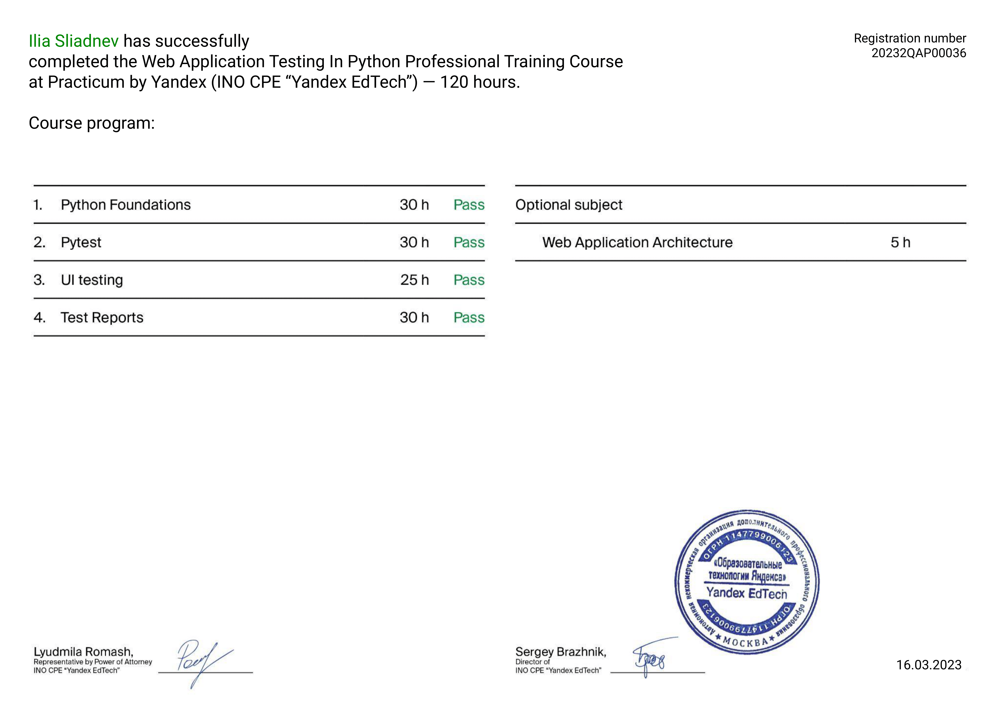
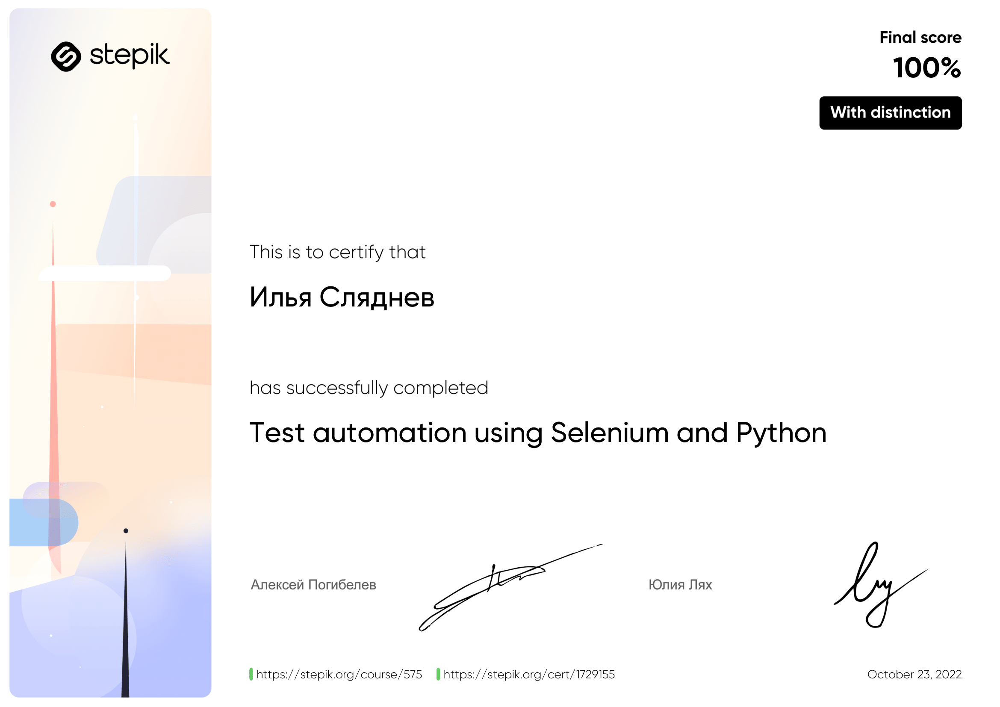
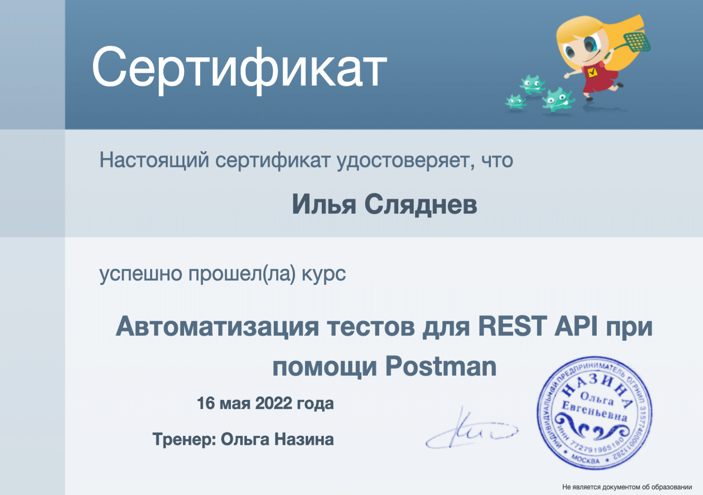
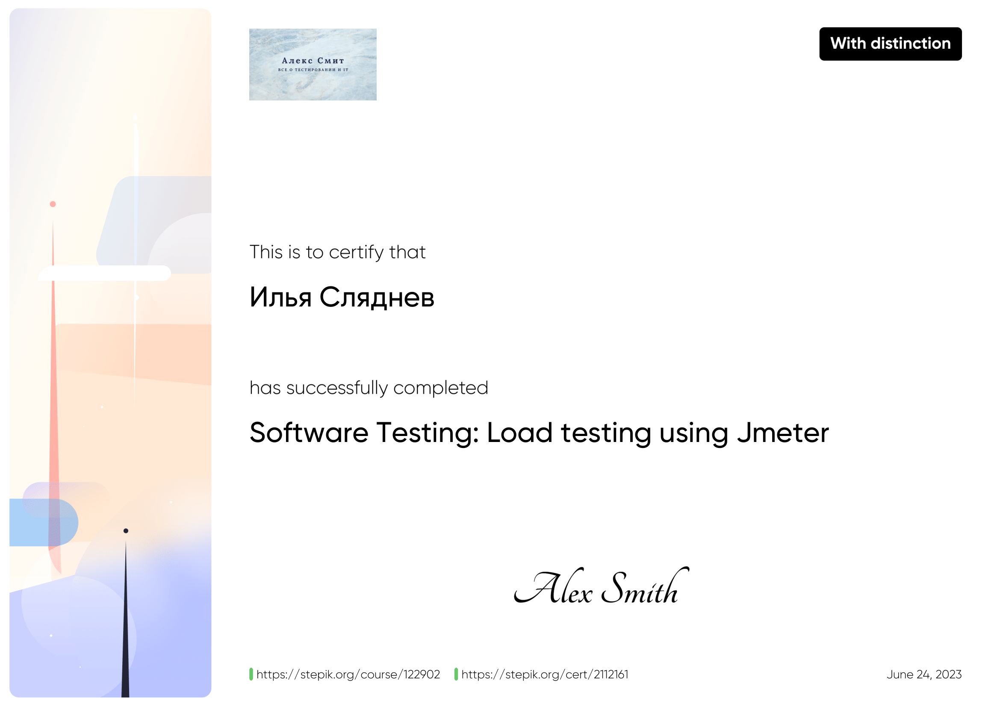
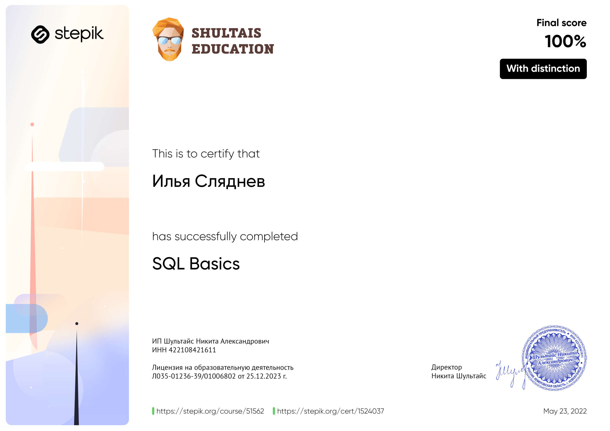

<table>
  <tr>
    <th colspan="2" style="text-align:center;"><h3>QAGURU</h3></th>
  </tr>
  <tr>
    <td width="30%">
 Web Automation
 API automation
 Mobile automation
 Test Management
 Infrastructure and notifications

  </td>
    <td width="70%">
      
    </td>
  </tr>
  
  <tr>
    <th colspan="2" style="text-align:center;"><h3>[Yandex EdTech] Web Application Testing In Python</h3></th>
  </tr>
  <tr>
    <td width="30%">

 Python Foundations
 Pytest
 UI testing
 Test Reports
 Web Application Architecture

  </td>
    <td width="70%">
      
      
    </td>
  </tr>
  
  <tr>
    <th colspan="2" style="text-align:center;"><h3>Automating testing with Selenium and Python</h3></th>
  </tr>
  <tr>
    <td width="30%">

 Web Automation
 Selenium
 Pytest
 Using the Page Object Model pattern

  </td>
    <td width="70%">
      
    </td>
  </tr>
  
  <tr>
    <th colspan="2" style="text-align:center;"><h3>LernQA</h3></th>
  </tr>
  <tr>
    <td width="30%">

 Test automation for REST API
 API automation
 Pytest
 Request

  </td>
    <td width="70%">
      
    </td>
  </tr>
  
  <tr>
    <th colspan="2" style="text-align:center;"><h3>Software-testing</h3></th>
  </tr>
  <tr>
    <td width="30%">

 Test automation for REST API with Postman
 API automation
 Infrastructure & Notifications
 Basics of JavaScript
 Libraries node.js and chai.js
 API Work
 SQL

  </td>
    <td width="70%">
      
    </td>
  </tr>
  
  <tr>
    <th colspan="2" style="text-align:center;"><h3>Software Testing: Load testing using Jmeter</h3></th>
  </tr>
  <tr>
    <td width="30%">

 API automation
 Load testing
 Groovy

  </td>
    <td width="70%">
      
    </td>
  </tr>
  
  <tr>
    <th colspan="2" style="text-align:center;"><h3>SQL basics</h3></th>
  </tr>
  <tr>
    <td width="30%">

 Simple SQL queries
 Add, change, delete
 Creating Tables
 Indexes
 Search text
 Data grouping
 Multiple table queries (JOIN, UNION)
 Nested queries

  </td>
    <td width="70%">
      
    </td>
  </tr>
  
</table>
