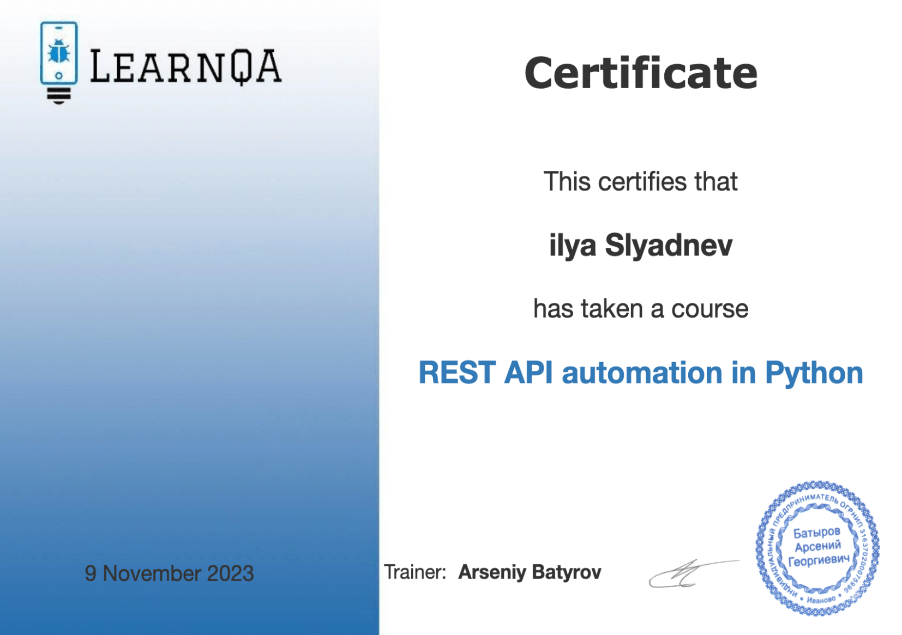

### QAGURU
- Web Automation
- API automation
- Mobile automation
- Test Management
- Infrastructure and notifications
  

### ____________________________________________________________________________________________

### [Yandex EdTech] Web Application Testing In Python
- Python Foundations
- Pytest
- UI testing
- Test Reports
- Web Application Architecture
  

### ____________________________________________________________________________________________

### Automating testing with Selenium and Python
- Web Automation
- Selenium
- Pytest
- Using the Page Object Model pattern

### ____________________________________________________________________________________________

## LernQA
- Test automation for REST API
- API automation
- Pytest
- Request

### ____________________________________________________________________________________________

## Software-testing
- Test automation for REST API with Postman
- API automation
- Infrastructure & Notifications
- Basics of JavaScript
- Libraries node.js and chai.js
- API Work
- SQL

### ____________________________________________________________________________________________

## Software Testing: Load testing using Jmeter
- API automation
- Load testing
- Groovy

### ____________________________________________________________________________________________

## SQL basics
- Simple SQL queries
- Add, change, delete
- Creating Tables
- Indexes
- Search text
- Data grouping
- Multiple table queries (JOIN, UNION)
- Nested queries

### ____________________________________________________________________________________________

